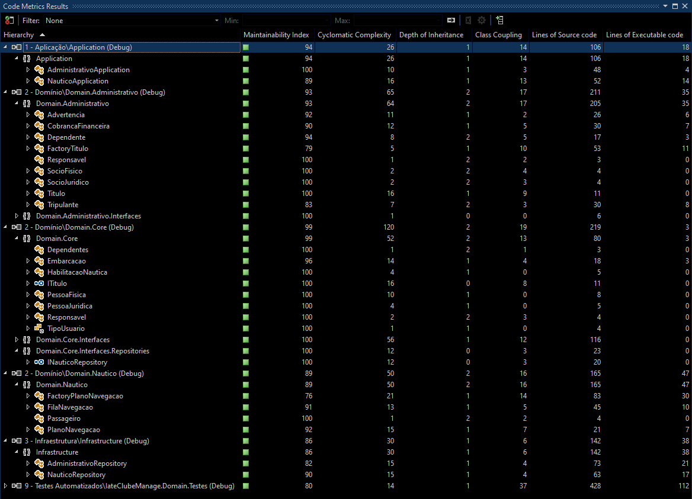
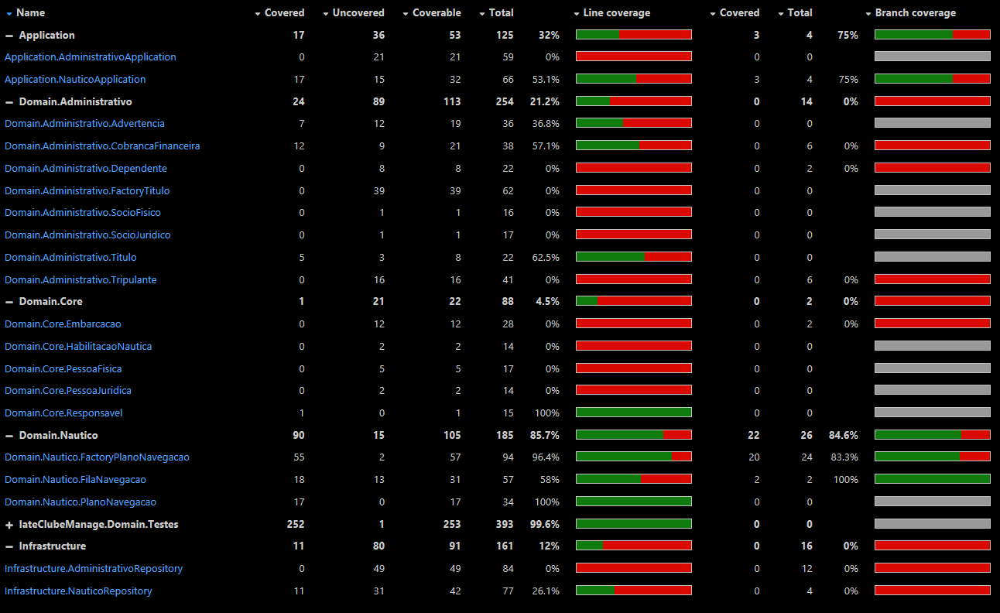
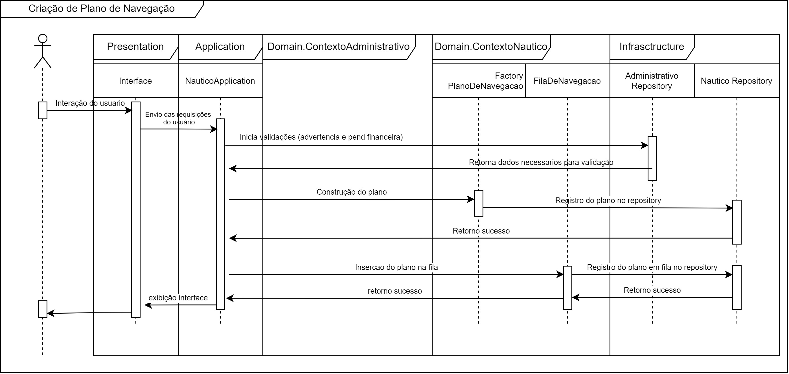

# IateClubManager
Trabalho do Módulo de C# do curso de pós-graduação de Engenharia de Software (Infnet)

### Descrição textual do Domínio.

A aplicação ICM possui seu design baseado em DDD, onde seu domínio ficou definido em dois contextos, são eles: contexto administrativo e náutico.
O Contexto administrativo tem como responsabilidade, gerenciar os aspectos da regra de negócio onde está contido dados dos Sócios e suas agregações (Responsável, dependentes, Tripulantes, etc) e também abrangendo as regras de titularidade junto ao clube.
Já o contexto náutico, responsabiliza-se pelas regras de negócio relacionadas à navegação, como por exemplo validações pertinentes à permissão de navegação, criação do plano de navegação e gerenciamento da fila de navegação.
O domínio se relaciona com a camada Application com requisições e respostas a essas validações.
Já sua relação com a Infrastructure diz respeito ao armazenamento dos dados e seus métodos, referente aos sócios e suas agregações, assim como os dados de navegação das embarcações.

### Diagrama de classe do modelo de domínio:
### Diagrama de classe do modelo de domínio:
[Clique aqui para acessar o link do diagrama:](https://github.com/marlonbraga/IateClubManager/blob/main/Diagramas-Diagrama_de_Classes.jpg)

### Análize de Código

### Cobeerura de Teste Unitários

### Requisitos funcionais e Casos de uso
##### Requisitos Funcionais
 - **RF-01:** O sistema deve permitir manter os sócios (pessoa jurídica e física)
 - **RF-02:** O sistema deve permitir que o sócio efetue o pagamento
 - **RF-03:** O Sistema deve permitir que o sócio acesse o histórico de pagamento
 - **RF-04:** O usuário deve poder acessar o sistema
 - **RF-05:** O Sistema deve permitir manter o plano de navegação
 - **RF-06:** Usuário deve poder acessar o histórico de navegação
 - **RF-07:** O sistema deve permitir manter a fila de navegação

##### Casos de Uso
 - **UC-01:** CadastrarSocio
 - **UC-02:** EditarSocio
 - **UC-03:** ListarSocios
 - **UC-04:** ExcluirSocio
 - **UC-05:** VisualizarDadosSocio
 - **UC-06:** ManterDependente
 - **UC-07:** ManterTripulante
 - **UC-08:** ManterEmbarcação
 - **UC-09:** EfetuarPagamento
 - **UC-10:** ExibirHistoricoDePagamentos
 - **UC-11:** Acessar Sistema
 - **UC-12:** CriacaoPlanoDeNavegacao
 - **UC-13:** AdicionarNavegacao
 - **UC-14:** ExibirNavegacoes
 - **UC-15:** CancelarNavegacao
 - **UC-16:** AcessarHistoricoDeNavegacao
 - **UC-17:** TrocarPosicao 
 - **UC-18:** AdicionarNavegacao
 - **UC-19:** ExibirNavegacoes
 - **UC-20:** CancelarNavegacao

### Identificação das entidades

Entidade de Domínio: 
|Entidade| Descrição|
|---|---|
| Titulo | Entidade que concede acesso a todos os serviços do clube |
| SocioFisico | Tipo de sócio que não está ligado a uma empresa |
| SocioJuridico | Tipo de socio ligado a uma empresa |
| Tripulante | Personagem do sistema que é necessário para haver uma navegação |
| Responsavel | Responsavel pela sociedade da pessoa jurídica |
| Dependente | Personagem que tem acesso por meio de algum sócio; |
| CobrancaFinanceira | Refere-se às cobranças relacionadas ao título do sócio |
| HabilitacaoNautica | Refere-se ao documento do tripulante |
| PlanoDeNavegação | Refere-se ao conjunto de informações para que a embarcação possa ser liberada para navegação, contendo data de saída e retorno, destino, responsável, etc.|
| FilaDenavegação | Refere-se ao conjunto de planos de navegações com a finalidade de controle do fluxo das navegações no clube|
| Embarcacao | Refere-se à embarcação vinculada ao título do sócio.|
| Passageiro | Refere-se às pessoas físicas, exceto os tripulantes, que estão embarcadas para uma navegação.|

### Identificação dos objetos de valor

 - Advertencia: Considerado um objeto de valor em nosso sistema por ser um objeto imutável, não possuindo seter’s, sua alteração se dá por meio da eliminação de um e re-criação de outro objeto;

### Identificação dos agregados e composições

 - Toda vez que temos composição, significa que a parte não existe sem o todo.
 - Toda vez que temos agregação, significa que a parte pode ser compartilhada entre vários objetos.

##### Agregados:
 - Sócio possui os agregados: HabilitacaoNautica, Titulo;
 - Socio Juridico possui os agregados: Responsável;
 - Titulo possui os agregados : Dependente, Advertencia, CobrancaFinanceira, Embarcacao;
 - FilaDeNavegacao possui os agregados : PlanoDeNavegacao

##### Composições:
 - Título não existe sem sócio
 - Cobrança não existe sem título
 - Dependente não existe sem sócio
 - HabilitacaoNauticanão existe sem pessoa;
 - FilaDeNavegacao não existe sem planoDeNavegacao;
 - PlanoDeNavegacao não existe sem Embarcacao, Responsavel;

### Identificação dos repositórios

##### Repositorio Administrativo: 
 - BuscarHistoricoDePagamentos(ITitulo): List<Pagamentos>: Método para listar todos as cobranças financeiras, realizados para o título.
 - CriarPagamento(ITitulo): void: Metodo para inserir uma cobrança no título do sócio,
 - AtualizarPagamento(ITitulo): void: Metodo responsavel pela atualização da cobrança financeira
 - DeletarPagamento(ITitulo): void: Método para remover uma cobrança financeira.
 - BuscarDadosTitulo(): ITitulo: Metodo responsavel por retornar os dados do titulo
 - CriarTitulo(): Titulo: Método responsável por inserir um título novo.
 - BuscarTitulos(): List<ITitulo>: Método responsável pela localização do título em uma tabela.
 - AtualizarTitulo(): void: Método responsável pela modificação de dados para um título.
 - DeletarTitulo(): void: Método responsável pela exclusão de um título.

##### Repositório Nautico;
 - CriarPlanoDeNavegacao(IResponsavel): PlanoDeNavegacao: Responsável pela criação do plano de navegação.
 - BuscarPlanoDeNavegacao(IResponsavel): PlanoDeNavegacao: Responsável por localizar um planos de navegação.
 - CriarNavegacao(PlanoDeNavegacao): void
 - BuscarNavegacao(): PlanoDeNavegacao: Retorna as navegações em andamento
 - AtualizarNavegacao(PlanoDeNavegacao): void: Responsável por alterar alguma informação referente ao plano de navegação.
 - DeletarNavegacao(PlanoDeNavegacao): void: Responsável pela exclusão do plano de navegação..
 - BuscarHistoricoDeNavegacao(Socio): List<IPlanoDeNavegacao>: Responsável pela visualização das navegações já concluídas.

### Identificação dos serviços de domínio

##### NauticoAplication

  - CriacaoPlanoDeNavegacao(IResponsavel): PlanoDeNavegacao
  - AdicionarNavegacao(PlanoDeNavegacao): void
  - ExibirNavegacoes(): List<IPlanoDeNavegacao>
  - AlterarNavegacao(PlanoDeNavegacao): void
  - CancelarNavegacao(PlanoDeNavegacao): void
  - TrocarPosicao(PlanoDeNavegacao) : void
  - LiberarNavegacao(PlanoDeNavegacao): void
  - AcessarHistoricoDeNavegacao(Socio): List<IPlanoDeNavegacao>

##### AdministrativoAplication
  - CadastrarSocio(): Titulo
  - EditarSocio(): void
  - ListarSocios(): List<ITitulo>
  - ExcluirSocio(): void
  - VisualizarDadosSocio(): ITitulo
  - EfetuarPagamento(ITitulo): void
  - HistoricoDePagamentos(ITitulo): List<Pagamentos>
  - IncluirDependente(ITitulo): void
  - IncluirTripulante(ITitulo): void

### Projeto de interfaces ou classes para dois serviços; Testes unitários; Projeto baseado nos princípios S.O.L.I.D.

O projeto abaixo atende às rubricas nº 09, 10 e 11 da tarefa proposta.

### Entendimento do DDD através de um diagrama de sequência
[Clique aqui para acessar o link do diagrama:](https://github.com/marlonbraga/IateClubManager/blob/main/Diagramas-Diagrama_de_sequencia.jpg)

### Linguagem Ubíqua 
##### Contexto Náutico:

|Nome|Descrição|
|------------|-----------------------------------------------------------------------------|
| Tripulante | Pessoa habilitada para assumir ou assegurar as operações de uma embarcação. |
| Habilitação Náutica| Documento único, registrado em nome da pessoa física, que o habilita a navegar e assumir as responsabilidades como tripulante.|
| Advertência| Registro de aviso por conduta inapropriada da parte do Sócio em relação ao Iate Club.|
| Pendência financeira| Dívida financeira do sócio para com o Iate Club.|
| Embarcação Enfileirada| Organização do plano dos planos de navegação em espera e/ou em andamento.|
| Time de gestão| Pessoas responsáveis pelo gerenciamento da aplicação.|
| Registro na marinha| Registro único referente a embarcação. |
| Responsável (embarcação)| Tripulante habilitado para assumir a navegação.|
| Passageiro| Pessoa que, momentaneamente, está embarcado para um plano de navegação.

##### Contexto Administrativo:

|Nome|Descrição|
|------------|-----------------------------------------------------------------------------|
|Sócio | Pessoa física ou jurídica, que possui título de sociedade vinculado ao Iate Clube. |
|Título | Registro de sócio junto ao clube |
|Responsável (pessoa jurídica) | Pessoa física representante contratual de uma empresa. |
|Dependentes | Pessoas físicas relacionadas à titularidade do sócio autorizadas para gozar benefícios do Iate Club. |

### Referências Bibliográficas

- YIN, Robert K. **Estudo de caso:** planejamento e métodos. 2. ed. Porto Alegre: Bookman, 2001.          
- LARMAN, Craig. Utilizando UML e padrões: Uma introdução a análise e ao projeto orientados a objetos e ao desenvolvimento interativo. 3ª ed. Porto Alegre: Bookman, 2007.
- VERGARA, Silvia Constant. **Projetos e Relatórios de Pesquisa em Administração.** São Paulo:  Atlas, 1998.
Evans, Eric. Domain-Driven-Design. Alta Books; 3ª edição 2016
- SOMMERVILLE, Ian. Engenharia de Software. 9ª ed. Rio de Janeiro: Pearson, 2012.
- T.A. GUEDES, Gilleanes. UML 2 Uma abordagem prática. Novatec Editora; 3ª edição 2018

